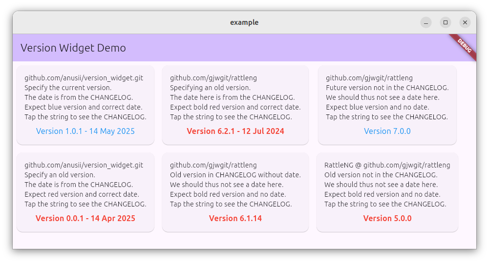

# Version Widget

A Flutter widget that displays version information with optional
changelog date and link. This widget is designed to be used across
multiple apps to maintain consistent version display and changelog
access.



## Features

- Display version information
- Optional release date display
- Automatic date extraction from CHANGELOG.md files
- Clickable link to view the full changelog
- Customizable styling
- Fallback date support
- Custom tooltip messages
- Visual indicators for version status
- Network connectivity handling
- Formatted date display (DD MMM YYYY)
- Accurate date matching for current version

## Installation

Add this to your package's `pubspec.yaml` file:

```yaml
dependencies:
  version_widget: ^0.0.9
```

## Usage

Basic usage:

```dart
import 'package:version_widget/version_widget.dart';

// In your widget tree:
VersionWidget(
  version: '1.0.0',  // Required parameter
)
```

With changelog support:

```dart
VersionWidget(
  version: '1.0.0',  // Required parameter
  changelogUrl: 'https://github.com/yourusername/yourrepo/raw/main/CHANGELOG.md',
  showDate: true,
  defaultDate: '20240101',
)
```

With custom tooltip messages:

```dart
VersionWidget(
  version: '1.0.0',  // Required parameter
  changelogUrl: 'https://github.com/yourusername/yourrepo/raw/main/CHANGELOG.md',
  isLatestTooltip: 'Your app is up to date! Enjoy the latest features.',
  notLatestTooltip: 'Version $_latestVersion is available with new features!',
)
```

## Version Status Indicators

- Grey text: Version is being checked
- Blue text: Version is up to date
- Red bold text: Newer version is available
- No date shown: Internet connection unavailable

## CHANGELOG.md Format

The widget expects the CHANGELOG.md file to have dates in the following format:
```markdown
## [1.0.0 20240101]
- Initial release
```

The widget will automatically find the correct release date for the current version by matching against all version entries in the changelog.

## Properties

- `version` (required): The version string to display. Must be provided.
- `changelogUrl` (optional): URL to the CHANGELOG.md file
- `showDate` (optional): Whether to show the release date (defaults to true)
- `defaultDate` (optional): Default date to show if changelog cannot be fetched (format: YYYYMMDD)
- `isLatestTooltip` (optional): Custom message to show when version is latest
- `notLatestTooltip` (optional): Custom message to show when newer version is available

## Contributing

Contributions are welcome! Please feel free to submit a Pull Request.

## License

This project is licensed under the MIT License - see the LICENSE file for details.
